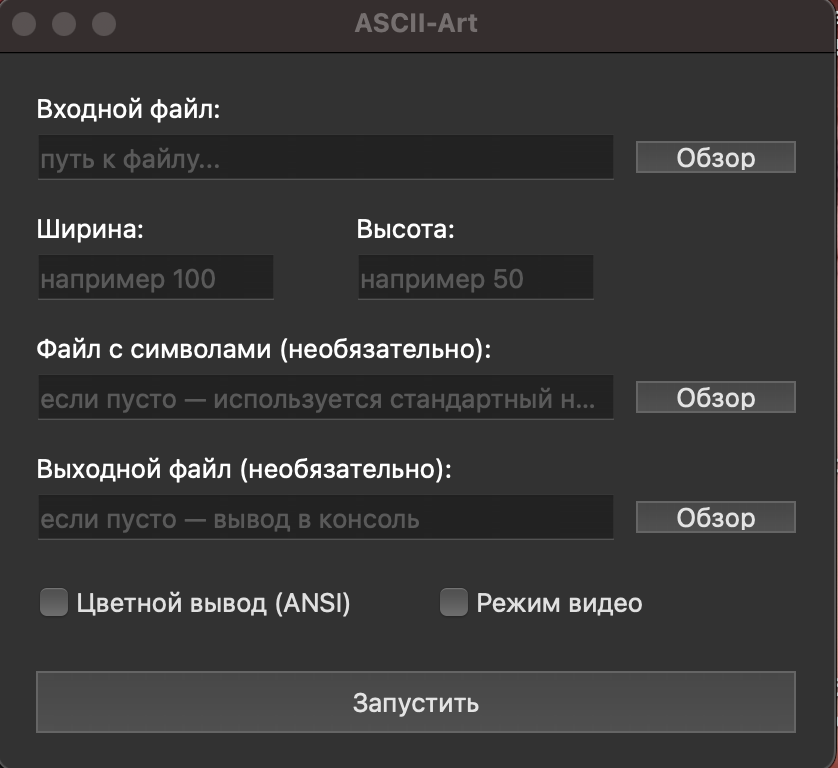
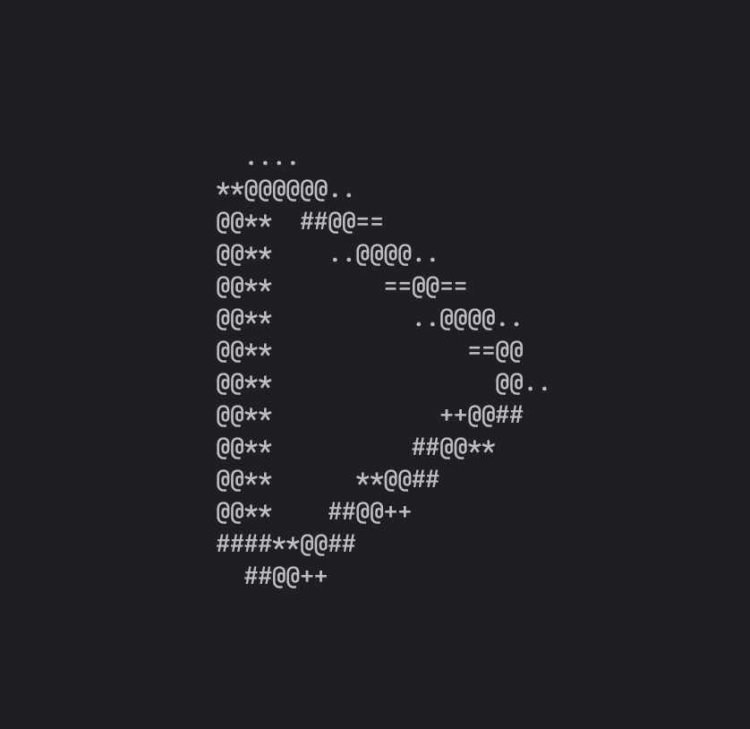
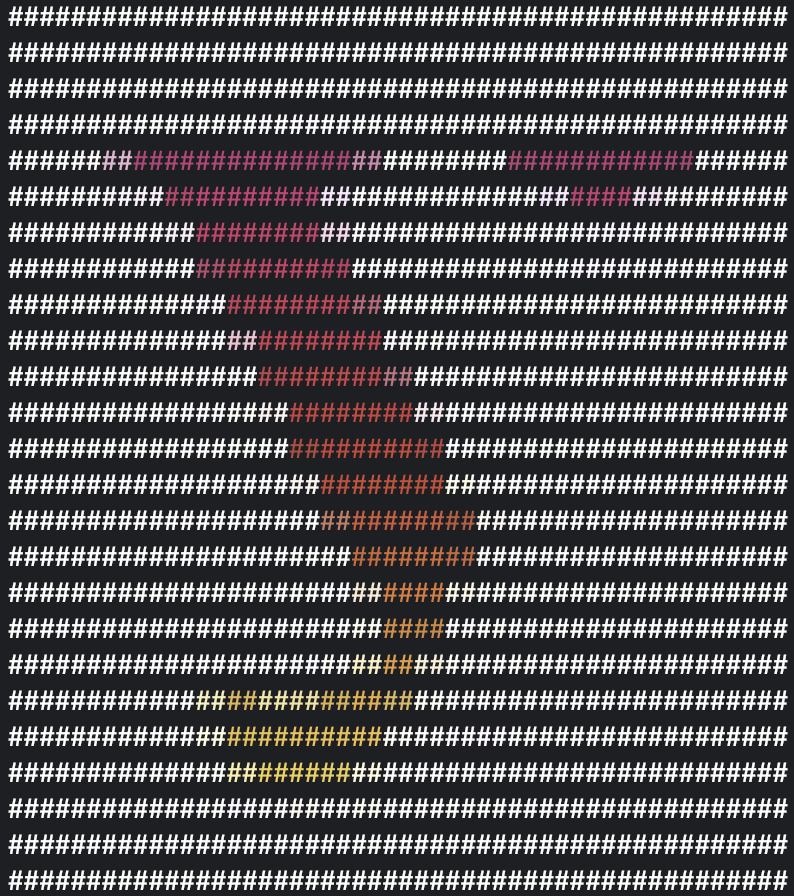

# ASCII-Art

Программа для преобразования изображения/видео в формат 
ASCII-Art с возможностью выбора символов и цветной генерации.

### Быстрый старт
Вам необходим питон версии 3.9+ (протестировано на версии 3.9). <br>
Необходимо скачать исходные файлы. <br>
Необходимо установить библиотеки: <br>
➤```pip3 install PyQt6``` <br>
➤```pip3 install opencv-python```

Либо воспользоваться автоматической установкой пакетов: <br>
➤```pip3 install -r requirements.txt```

#### Консольный старт
Запустите файл main.py, указав аргументы командной строки, например <br>
➤```python3 main.py -i <входное изображение> -w <ширина>``` <br>
Подробнее узнать про аргументы командной строки можно узнать вызвав справку <br>
➤```python3 main.py --help```

#### Запуск графического интерфейса
Запустите файл gui.py ➤```python3 gui.py```



### Примеры работы программы
<hr>
Команда: <br>
➡️<code>python3 main.py -i <путь к изображению> -H 25</code> <br> <br>
Результат: <br>
 
<hr>

Команда: <br>
➡️<code>python3 main.py -i <путь к изображению> -H 25 -a -s char.txt</code> <br> <br>
Результат: <br>

<hr>

Команда: <br>
➡️<code>python3 main.py -i <путь к видео> -H 25 -v</code> <br> <br>
Результат: <br>

<hr>

